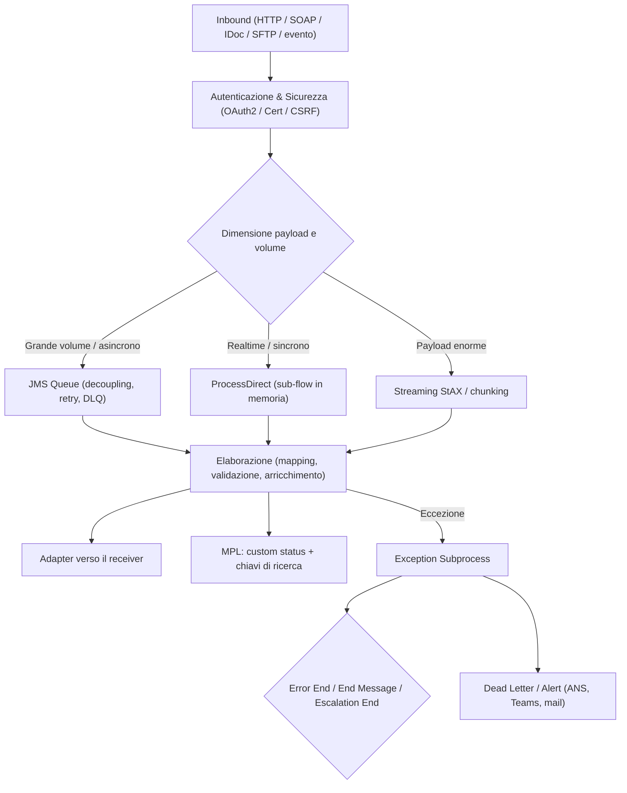

# 🚀 SAP Cloud Integration (CPI) — iFlow Expert Skill

Guida in italiano alla skill **`sap-cpi-iflow`**: un pacchetto di conoscenza e istruzioni operative per
progettare, sviluppare, ottimizzare, mettere in sicurezza e gestire i flussi di integrazione (**iFlow**) su
**SAP Integration Suite / SAP Cloud Integration**.

Il contenuto tecnico della skill è in inglese (è la lingua di lavoro dei progetti di integrazione e della
documentazione SAP); questa guida spiega in italiano com'è fatta e come si usa.

---

## 📁 Struttura del pacchetto

```text
sap-cpi-iflow/
├── SKILL.md                        # Punto di ingresso: tabella di instradamento, regole d'oro, procedura
├── README.md                       # Panoramica, ambito, installazione (in inglese)
├── CHANGELOG.md                    # Storico delle versioni del pacchetto
├── CONTRIBUTING.md                 # Come estendere il pacchetto mantenendolo coerente
├── sap_cpi_skill_guide.md          # Questo documento
│
├── references/                     # Guide tematiche approfondite (si carica solo quella che serve)
│   ├── design-guidelines.md                 # Qualità, architettura a livelli, pattern EIP, splitter, anti-pattern
│   ├── groovy-best-practices.md             # Runtime, gestione memoria, API MPL, thread safety, stile
│   ├── groovy-recipes.md                    # Ricettario di script pronti per i problemi ricorrenti
│   ├── adapters-and-connectivity.md         # Scelta adapter, HTTP/OData, file, backend SAP, sicurezza canale
│   ├── mapping-and-transformation.md        # Message mapping, XSLT, Groovy, converter, modello canonico
│   ├── error-handling-and-monitoring.md     # Tassonomia errori, Exception Subprocess, retry, DLQ, idempotenza
│   ├── monitoring-and-operations.md         # MPL, livelli di log, ricerca, alerting, triage incidenti
│   ├── security-and-governance.md           # Autenticazione, credenziali, TLS, CSRF, esternalizzazione, naming
│   ├── performance-and-sizing.md            # Quote tenant, matrice streaming, parallelismo, sizing
│   ├── persistence-and-decoupling.md        # JMS vs Data Store vs Variables vs Event Mesh
│   ├── transport-and-alm.md                 # Strategia tenant, trasporto, CI/CD, promozione, rollback
│   └── testing-and-quality.md               # Analisi statica, unit test, simulazione, test dei failure path
│
├── examples/                       # Script Groovy orientati alla produzione (con indice in README.md)
├── checklists/                     # Gate da eseguire: design review, go-live, triage incidenti
└── templates/                      # Documenti da compilare: design document, specifica d'interfaccia
```

---

## 🏛️ Architettura di riferimento



---

## ⚡ Le regole d'oro (sintesi)

1. **CPI è un orchestratore, non un backend:** la logica di dominio resta nel sistema di registro.
2. **Mai caricare payload grandi come `String`:** `getBody(String)` porta l'intero messaggio in heap.
3. **La catena di streaming vale quanto il suo anello più debole:** un solo step non-streaming la rompe.
4. **Properties per lo stato interno, header solo per i metadati di protocollo.**
5. **Ogni router deve avere un ramo di default.**
6. **Tutto ciò che dipende dall'ambiente va esternalizzato** con `{{parametri}}`.
7. **Ogni flusso di produzione ha un Exception Subprocess**, con end event scelto deliberatamente.
8. **Gli errori devono essere ricercabili:** custom status + chiavi di business nel MPL.
9. **Mai loggare né trasportare segreti.**
10. **Disaccoppia prima di scalare.**
11. **Limita parallelismo e dimensione dell'input.**
12. **La fonte di verità è il repository, non il tenant.**

---

## 💡 Come si usa la skill

### Con un assistente AI
La tabella di instradamento nella sezione 1 di `SKILL.md` collega il tipo di richiesta al file più pertinente.
L'assistente carica quel file e risponde secondo il "contratto di output" (sezione 4 di `SKILL.md`):
decisione di design, artefatti concreti, impatto operativo, assunzioni e rischi dichiarati.

Esempi di richieste che attivano la skill:
- *"Questo script Groovy va in OutOfMemory su un file da 200 MB: come lo riscrivo?"*
- *"Come imposto un Exception Subprocess con retry su JMS e DLQ?"*
- *"Aiutami a disegnare un iFlow modulare per integrare S/4HANA OData con Salesforce."*
- *"Questo iFlow è pronto per il go-live? Fammi la design review."*
- *"L'interfaccia ordini è ferma da stamattina: da dove comincio il triage?"*

### Come sviluppatore
- `references/` per prendere una decisione di design o risolvere un dubbio tecnico;
- `examples/` per non riscrivere da zero gli script ricorrenti;
- `checklists/` come gate prima dello sviluppo, prima del go-live e durante un incidente;
- `templates/` per produrre la documentazione che serve comunque (design document e specifica d'interfaccia).

---

## 📌 Nota sull'affidabilità dei contenuti

I dati di piattaforma citati nelle guide (limiti del tenant, matrice di streaming, nomi di header e API,
comportamento documentato) sono presi dalla documentazione ufficiale SAP e i link alle fonti sono in fondo a
ogni guida. Dove un dettaglio dipende dalla release del tenant, la guida lo dichiara esplicitamente invece di
inventarlo: verifica sempre il parametro esatto nella tua versione.

Gli script di esempio sono forniti **così come sono**: vanno rivisti, testati e adattati prima dell'uso in
produzione, prestando attenzione alle assunzioni sulla dimensione del payload indicate in testa a ogni file.

---

## 📄 Licenza

MIT — vedi [LICENSE](LICENSE).
